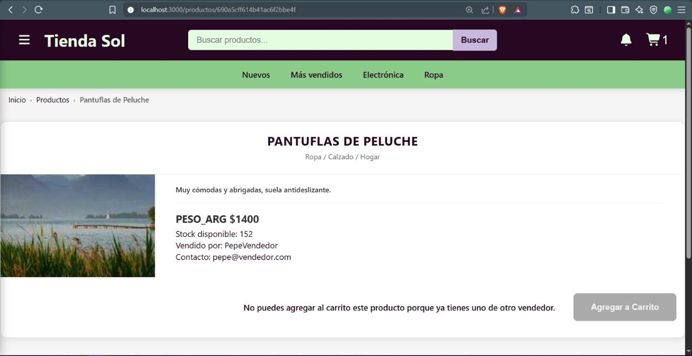
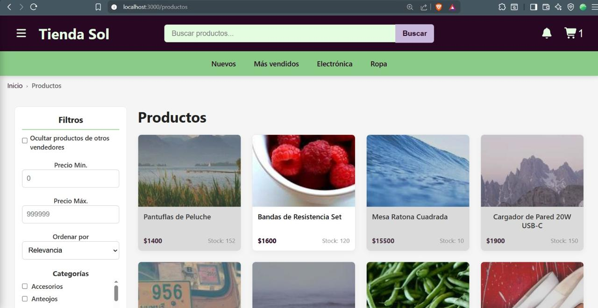

# Tienda Sol - Full Stack E-commerce Platform

## 📌 Project Overview
Tienda Sol is an E-commerce solution built with a Full Stack JavaScript approach. The project is managed as a Monorepo using npm workspaces, integrating a dynamic React frontend with a robust Express.js backend.

The platform follows a strict Layered Architecture (Routers, Controllers, Repositories, and Domain Models), ensuring high maintainability and a clear separation of concerns between business logic and data access.

## 🏗️ Architecture & Technical Stack
The project is structured into two main packages to streamline development and deployment:

### 🖥️ Frontend (React.js)
- SPA Architecture: Built with React hooks for efficient state and lifecycle management.

- Responsive UI: Optimized for both mobile and desktop environments, ensuring a seamless user experience across all screen sizes.

- Component-Based: High reusability of UI elements across the platform.

### ⚙️ Backend (Node.js & Express)
- Layered Design: Organized into Controllers, Repositories, and Domain Models to handle complex e-commerce logic.

- Security & Middleware: Configured with CORS and Dotenv for secure, environment-specific management.

- API First: Exposes a clean RESTful API consumed by the React client.

## 🤖 Tech Stack
- Frontend: React.js & Next.js (for optimized routing and rendering).
- Backend: Node.js, Express.js & MongoDB (NoSQL Database).
- API Documentation: Swagger (OpenAPI Specification).
- Communication: Axios (Promise-based HTTP client).

## 🧪 Quality Assurance & Testing
- Smoke, Unit & Integration Testing: Implemented with Jest.
- End-to-End (E2E) Testing: Automated browser testing using Cypress to ensure critical user flows (like checkout) work perfectly.

## 📦 Project Structure

```
.
├── packages/
│   ├── backend/        # Express.js Server (Business Logic & API)
│   └── frontend/       # React Application (UI & User Experience)
├── package.json        # Monorepo configuration (npm workspaces)
```

## 📄 Requirements & Specifications
For a detailed look at the project's scope, business rules, and technical requirements defined for the **Desarrollo de Software (DDS)** course at **UTN FRBA**, you can access the formal documentation here:

👉 [**Project Specifications (PDF)**](./docs/Requirements&Specifications.pdf)

## 📸 Project Screenshots



## 🌐 API Documentation
The API is fully documented and testable via Swagger UI. Once the backend is running, you can access the documentation at `/api-docs`.

## 📡 Deployment
While the platform is not currently hosted on a live server, it includes all necessary configurations.
- Frontend: Hosted on Netlify.
- Backend & Database: Deployed using Render.

## 🚀 Quick Start (Development)
Follow these steps to get the project up and running:

### 1\. Install Dependencies

```bash
npm install
```

### 2\. Environment Setup

Create a `.env` file in `packages/backend` based on the `.env.example`provided.

```
# packages/backend/.env
ALLOWED_ORIGINS=http://localhost:3000,http://127.0.0.1:3000
SERVER_PORT=3001
```

### 3\. Running the Application

You can start the frontend and backend separately or both at the same time:

#### Run Backend

```bash
npm run start:backend
```

For development with automatic restart (hot-reload):

```bash
npm run dev:backend
```

#### Run Frontend

```bash
npm run start:frontend
```

#### Run Both (Development Mode)

To start the backend in dev mode and the frontend simultaneously, use:

```bash
npm run start:dev
```
